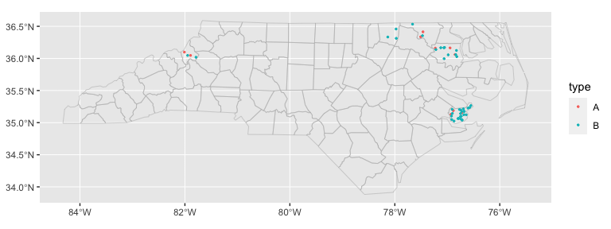
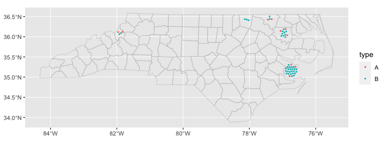

<!-- README.md is generated from README.Rmd. Please edit that file -->

# ggautomap

<!-- badges: start -->

[](https://cidm-ph.r-universe.dev)
[](https://github.com/cidm-ph/ggautomap/actions/workflows/R-CMD-check.yaml)
<!-- badges: end -->

`ggautomap` helps when you have a spreadsheet/table of data that
includes a column of place names, and you want to visualise that data on
a map. It saves you from having to think about geospatial libraries when
all you want to do is make a quick plot from your spreadsheet.

See [the ‘Getting started’
article](https://cidm-ph.github.io/ggautomap/articles/ggautomap.html),
`vignette("ggautomap")`, for some recipes for different types of plots
it can make.

`ggautomap` works best if:

- your data is about regions/areas/countries etc.,
- each row corresponds to an individual observation or data point, and
- the locations names in your data are part of a map that is registered
  with `{cartographer}`.

`ggautomap` might not be right for you if …

- … the place names in your location column aren’t known to
  `{cartographer}`. You’ll have to register the map data with
  `cartographer::register_map()` or load a package that does this for
  you. This is fairly painless to set up, and can be reused for
  subsequent plots once you get it working.

- … your data is about points instead of regions, or has only a single
  row for each region with aggregate data.

- … your data has latitude and longitude columns, or is already a
  geospatial object such as an `{sf}` dataframe.

- … you want to manipulate the geometries or otherwise have more
  control. `ggautomap` is aimed at the simple case, so the geometries
  are attached on the fly when the plot is compiled.

In most of these cases, you should instead use a combination of `{sf}`,
`ggplot2::geom_sf()`, and possibly `{cartographer}` to have more direct
control. If you just want the map insets from the vignette, see
`{ggmapinset}`.

## Installation

You can install ggautomap like so:

``` r
# CRAN release
install.packages('ggautomap')

# development version
install.packages('ggautomap', repos = c('https://cidm-ph.r-universe.dev', 'https://cloud.r-project.org'))
```

## Example

Let’s use the example dataset from `{cartographer}`:

``` r
library(cartographer)

head(nc_type_example_2)
#>      county type
#> 1    MARTIN    A
#> 2  ALAMANCE    B
#> 3    BERTIE    A
#> 4   CHATHAM    B
#> 5   CHATHAM    B
#> 6 HENDERSON    B
```

A possible workflow is to use `cartographer::add_geometry()` to convert
this into a spatial data frame and then use `ggplot2::geom_sf()` to draw
it.

`ggautomap` instead provides geoms that do this transparently as needed,
so you don’t need to do a lot of boilerplate to wrangle the data into
the right form before handing it off to the plotting code.

``` r
library(ggplot2)
library(ggautomap)

ggplot(nc_type_example_2, aes(location = county)) +
  geom_boundaries(feature_type = "sf.nc") +
  geom_geoscatter(aes(colour = type), size = 0.5) +
  coord_automap(feature_type = "sf.nc")
```



``` r
ggplot(nc_type_example_2, aes(location = county)) +
  geom_choropleth() +
  geom_boundaries(feature_type = "sf.nc") +
  scale_fill_steps(low = "#e6f9ff", high = "#00394d", na.value = "white") +
  coord_automap(feature_type = "sf.nc")
```


