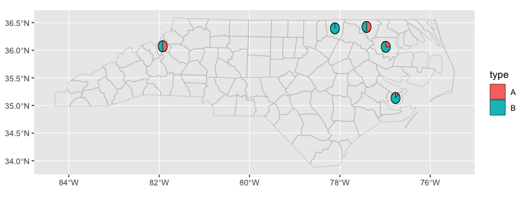

<!-- README.md is generated from README.Rmd. Please edit that file -->

# ggautomap

<!-- badges: start -->

[](https://cidm-ph.r-universe.dev)
<!-- badges: end -->

ggautomap makes it easy to visualise your data on a map when you have a
column in the data that names a place/region. Other packages can
register map data, such as `nswgeo`.

## Installation

You can install ggautomap like so:

``` r
options(repos = c(
  cidmph = 'https://cidm-ph.r-universe.dev',
  CRAN = 'https://cloud.r-project.org'))
  
install.packages('ggautomap')
```

## Example

ggautomap comes with one example dataset registered. You can register
additional map datasets or depend on another package that registers them
for you.

``` r
library(ggplot2)
library(ggautomap)

feature_types()
#> [1] "sf.nc"
head(feature_names("sf.nc"))
#> [1] "Ashe"        "Alleghany"   "Surry"       "Currituck"   "Northampton"
#> [6] "Hertford"
```

The example dataset will work with any data frame that has a column
containing place names in the list above.

``` r
set.seed(1234)
example <- data.frame(
  location = sample(feature_names("sf.nc"), size = 5) |>
             sample(size = 50, replace = TRUE, prob = c(2, 5, 1, 1, 1)),
  type = sample(c("A", "B"), size = 50, replace = TRUE, prob = c(3, 7))
)
head(example)
#>   location type
#> 1   Bertie    A
#> 2   Bertie    A
#> 3   Bertie    B
#> 4  Pamlico    B
#> 5   Warren    B
#> 6  Pamlico    B
```

You can then use this data with the geoms to provide map summaries. For
the map outline, you’ll need to specify `feature_type`, but the other
geoms will usually be able to guess the correct value.

``` r
ggplot(example, aes(location = location)) +
  geom_boundaries(feature_type = "sf.nc") +
  geom_geoscatter(aes(colour = type), size = 0.5)
```


``` r
ggplot(example, aes(location = location)) +
  geom_boundaries(feature_type = "sf.nc") +
  geom_centroids(aes(colour = type, scale = 6), size = 0.5)
```


``` r
ggplot(example, aes(location = location)) +
  geom_boundaries(feature_type = "sf.nc") +
  geom_choropleth() +
  scale_fill_steps(low = "#e6f9ff", high = "#00394d", na.value = "white")
```


``` r
ggplot(example, aes(location = location)) +
  geom_boundaries(feature_type = "sf.nc") +
  geom_pie(aes(fill = type), pie_radius = 0.1)
```


