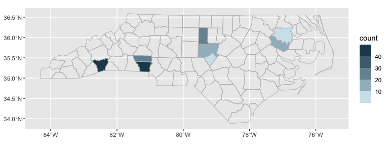

<!-- README.md is generated from README.Rmd. Please edit that file -->

# ggautomap

<!-- badges: start -->

[](https://cidm-ph.r-universe.dev)
[](https://github.com/cidm-ph/ggautomap/actions/workflows/R-CMD-check.yaml)
<!-- badges: end -->

`ggautomap` provides `{ggplot2}` geometries that make use of
`{cartographer}`, a framework for matching place names with map data.
With `ggautomap` your input dataset doesn’t need to be spatially aware:
the geometries will automatically attach the map data (providing it’s
been registered with `{cartographer}`).

See [the ‘Getting started’
article](https://cidm-ph.github.io/ggautomap/articles/ggautomap.html),
`vignette("ggautomap")`, for some recipes for different types of plots.

## Installation

You can install ggautomap like so:

``` r
# CRAN release
install.packages('ggautomap')

# development version
install.packages('ggautomap', repos = c('https://cidm-ph.r-universe.dev', 'https://cloud.r-project.org'))
```

## Example

Let’s use the example dataset from `{cartographer}`:

``` r
library(cartographer)

head(nc_type_example_2)
#>      county type
#> 1    MARTIN    A
#> 2  ALAMANCE    B
#> 3    BERTIE    A
#> 4   CHATHAM    B
#> 5   CHATHAM    B
#> 6 HENDERSON    B
```

A possible workflow is to use `cartographer::add_geometry()` to convert
this into a spatial data frame and then use `ggplot2::geom_sf()` to draw
it.

`ggautomap` instead provides geoms that do this transparently as needed,
so you don’t need to do a lot of boilerplate to wrangle the data into
the right form before handing it off to the plotting code.

``` r
library(ggplot2)
library(ggautomap)

ggplot(nc_type_example_2, aes(location = county)) +
  geom_boundaries(feature_type = "sf.nc") +
  geom_geoscatter(aes(colour = type), size = 0.5) +
  coord_automap(feature_type = "sf.nc")
```


``` r
ggplot(nc_type_example_2, aes(location = county)) +
  geom_choropleth() +
  geom_boundaries(feature_type = "sf.nc") +
  scale_fill_steps(low = "#e6f9ff", high = "#00394d", na.value = "white") +
  coord_automap(feature_type = "sf.nc")
```


