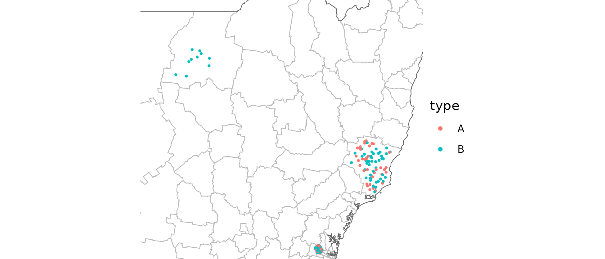
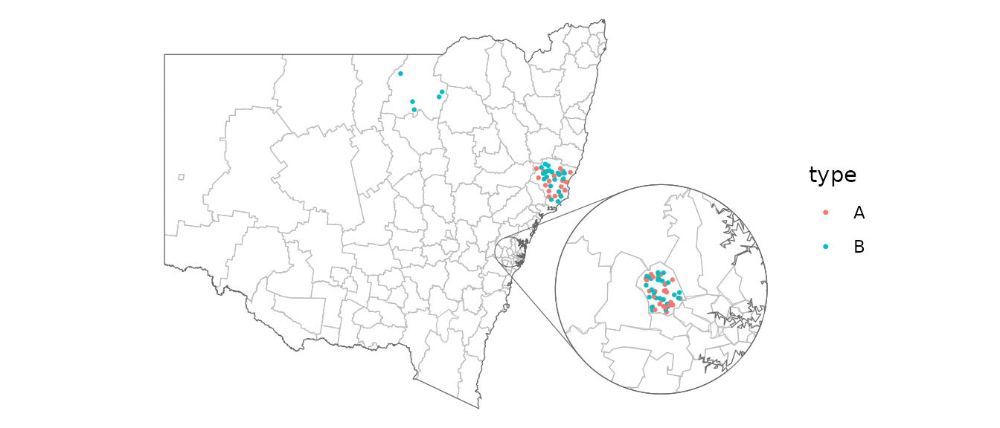
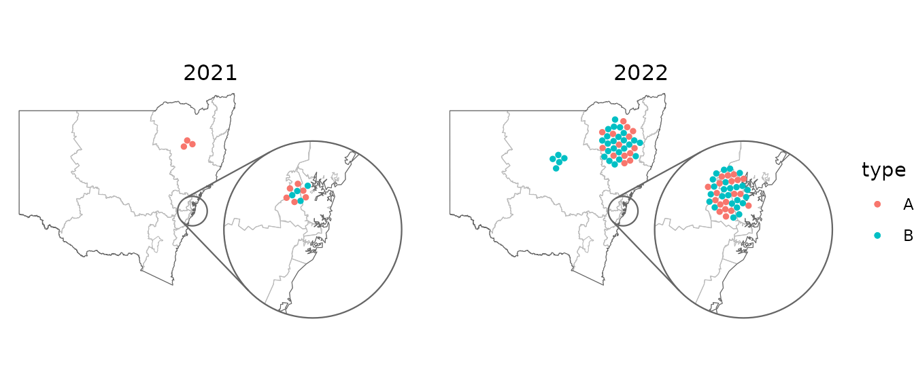
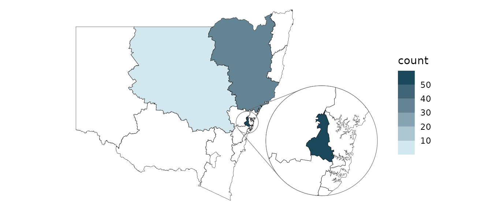
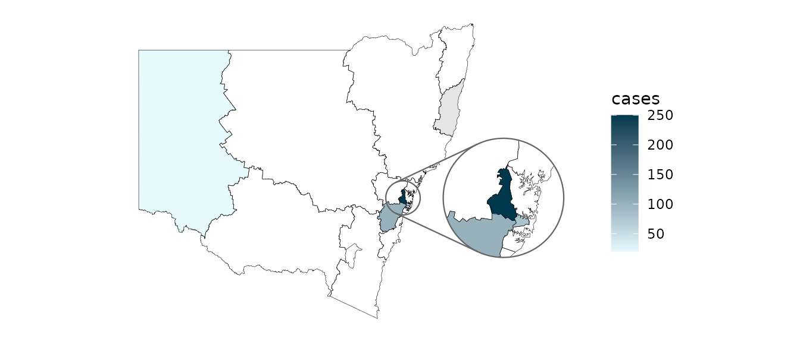
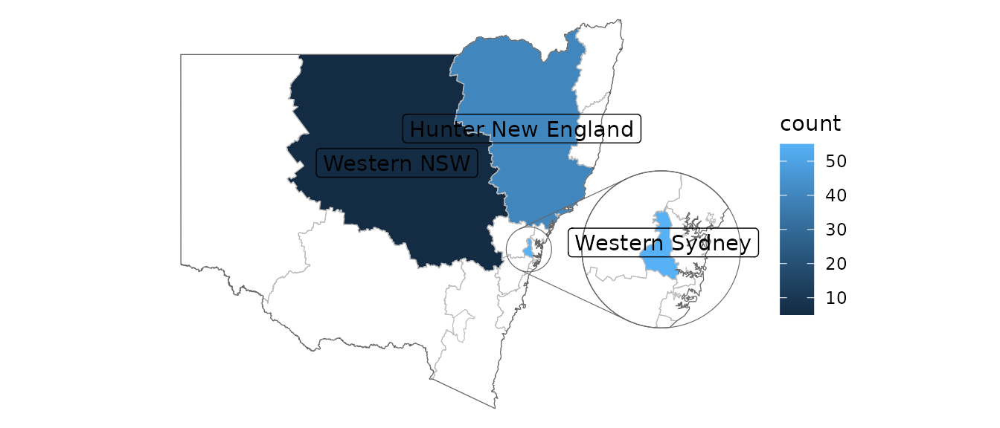
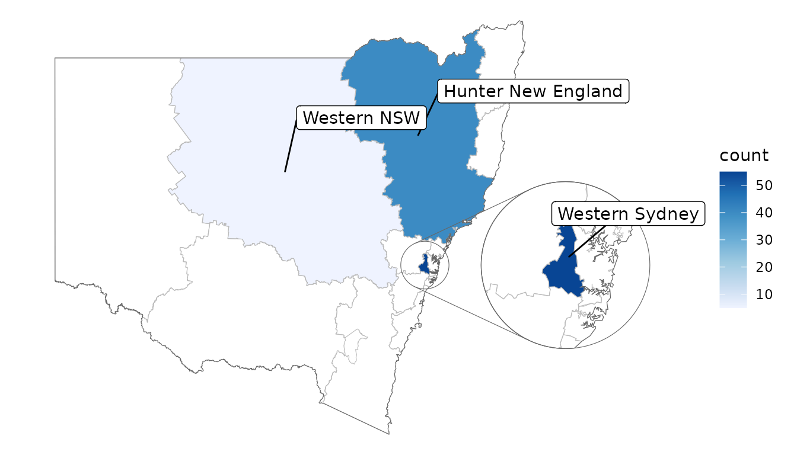
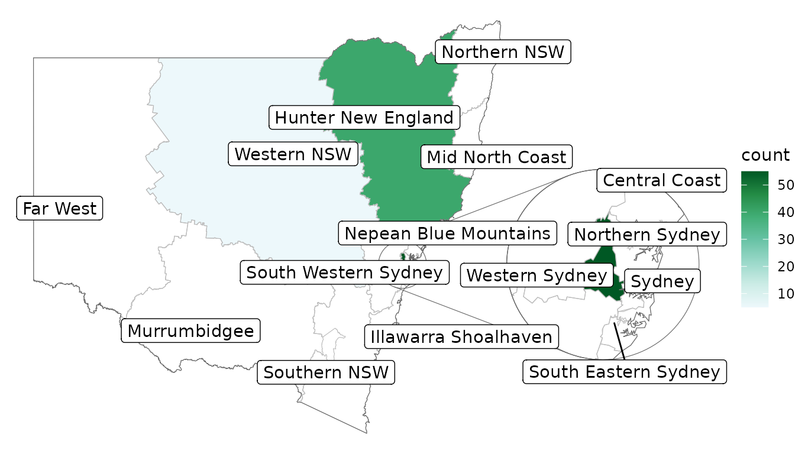

# Getting started with 'ggautomap'

``` r
library(nswgeo)
library(ggautomap)
library(ggplot2)
library(dplyr, warn.conflicts = FALSE)
```

This article provides some recipes for plots that might be of interest.
These examples use map data from the
[nswgeo](https://github.com/cidm-ph/nswgeo) package.

Many of the examples use the same example dataset modelled after the
structure of a linelist: rows are distinct events, and they can have a
`type` of `A` or `B`. Each event is associated with a location described
at different granularities by the `postcode`, `lga`, and `lhd` columns.

``` r
head(covid_cases_nsw)
#> # A tibble: 6 × 5
#>   postcode lga       lhd                 year type 
#>   <chr>    <chr>     <chr>              <int> <chr>
#> 1 2427     Mid-Coast Hunter New England  2022 B    
#> 2 2761     Blacktown Western Sydney      2021 A    
#> 3 2426     Mid-Coast Hunter New England  2022 B    
#> 4 2148     Blacktown Western Sydney      2022 B    
#> 5 2768     Blacktown Western Sydney      2021 A    
#> 6 2766     Blacktown Western Sydney      2021 B
```

You need to specify which column has the feature by setting the
`location` aesthetic. This example has three different columns of
locations for different feature types; your dataset only needs to have
one of these.

In general you’ll start with
[`geom_boundaries()`](https://cidm-ph.github.io/ggautomap/reference/geom_boundaries.md)
to draw the base map. This geom needs to be told which `feature_type`
you’re after (e.g. `"nswgeo.lga"` for LGAs). All of the summary geoms of
`ggautomap` can then be used to draw your data.

## Scatter

``` r
covid_cases_nsw |>
  ggplot(aes(location = lga)) +
  geom_boundaries(feature_type = "nswgeo.lga") +
  geom_geoscatter(aes(colour = type), sample_type = "random", size = 0.5) +
  coord_automap(
    feature_type = "nswgeo.lga",
    xlim = c(147, 153),
    ylim = c(-33.7, -29)
  ) +
  guides(colour = guide_legend(override.aes = list(size = 1))) +
  theme_void()
```



Points are drawn at random within the boundaries of their location.

## Insets

To show a zoomed in part of the map as an inset, you can configure an
inset and provide it to each relevant geom. The geoms in this package
are all inset-aware. See
[ggmapinset](https://github.com/cidm-ph/ggmapinset) for details.

``` r
covid_cases_nsw |>
  ggplot(aes(location = lga)) +
  geom_boundaries(feature_type = "nswgeo.lga") +
  geom_geoscatter(aes(colour = type), size = 0.5) +
  geom_inset_frame() +
  coord_automap(
    feature_type = "nswgeo.lga",
    inset = configure_inset(
      centre = "Blacktown",
      radius = 40,
      units = "km",
      scale = 7,
      translation = c(400, -100)
    )
  ) +
  theme_void()
#> Warning: The `radius` argument of `configure_inset()` is deprecated as of ggmapinset
#> 0.4.0.
#> ℹ Use `shape = shape_circle(centre, radius)` instead.
#> ℹ The deprecated feature was likely used in the ggautomap package.
#>   Please report the issue at <https://github.com/cidm-ph/ggautomap/issues>.
#> This warning is displayed once per session.
#> Call `lifecycle::last_lifecycle_warnings()` to see where this warning was
#> generated.
#> Warning in rep(pch, length.out = length(x)): 'x' is NULL so the result will be
#> NULL
```



## Packed points

This next example uses
[`geom_centroids()`](https://cidm-ph.github.io/ggautomap/reference/geom_centroids.md)
to place the points in a packed circle in the centre of each feature. It
also shows how you can fine-tune the plot with the usual
[ggplot2](https://ggplot2.tidyverse.org) functions.

``` r
covid_cases_nsw |>
  dplyr::filter(year >= 2021) |>
  ggplot(aes(location = lhd)) +
  geom_boundaries(feature_type = "nswgeo.lhd") +
  geom_centroids(aes(colour = type), position = position_circle_repel_sf(scale = 35), size = 1) +
  geom_inset_frame() +
  coord_automap(feature_type = "nswgeo.lhd", inset = configure_inset(
    centre = "Sydney", radius = 80, units = "km", feature_type = "nswgeo.lhd",
    scale = 6, translation = c(650, -100)
  )) +
  facet_wrap(vars(year)) +
  labs(x = NULL, y = NULL) +
  theme_void() +
  theme(strip.text = element_text(size = 12))
#> Warning in rep(pch, length.out = length(x)): 'x' is NULL so the result will be
#> NULL
#> Warning in rep(pch, length.out = length(x)): 'x' is NULL so the result will be
#> NULL
```



## Choropleths

If your data has multiple rows for each location (such as our example
dataset where the rows are disease cases) then you can use
[`geom_choropleth()`](https://cidm-ph.github.io/ggautomap/reference/choropleth.md)
to aggregate these into counts.

``` r
covid_cases_nsw |>
  ggplot(aes(location = lhd)) +
  geom_choropleth() +
  geom_boundaries(
    feature_type = "nswgeo.lhd", colour = "black", linewidth = 0.1,
    outline.aes = list(colour = NA)
  ) +
  geom_inset_frame() +
  coord_automap(feature_type = "nswgeo.lhd", inset = configure_inset(
    centre = "Western Sydney", radius = 60, units = "km",
    scale = 5, translation = c(400, -100)
  )) +
  scale_fill_steps(low = "#e6f9ff", high = "#00394d", n.breaks = 5, na.value = "white") +
  theme_void()
#> Warning in rep(pch, length.out = length(x)): 'x' is NULL so the result will be
#> NULL
```



On the other hand, if your dataset has only one row per location and
there is an existing column that you’d like to map to the `fill`
aesthetic, then instead use `geom_sf_inset(..., stat = "automap")`:

``` r
summarised_data <- data.frame(
  lhd = c(
    "Western Sydney",
    "Sydney",
    "Far West",
    "Mid North Coast",
    "South Western Sydney"
  ),
  cases = c(250, 80, 20, NA, 100)
)

summarised_data |>
  ggplot(aes(location = lhd)) +
  geom_sf_inset(aes(fill = cases), stat = "automap", colour = NA) +
  geom_boundaries(
    feature_type = "nswgeo.lhd",
    colour = "black",
    linewidth = 0.1,
    outline.aes = list(colour = NA)
  ) +
  geom_inset_frame() +
  coord_automap(
    feature_type = "nswgeo.lhd",
    inset = configure_inset(
      centre = "Western Sydney",
      radius = 60,
      units = "km",
      scale = 3.5,
      translation = c(350, 0)
    )
  ) +
  scale_fill_gradient(low = "#e6f9ff", high = "#00394d", na.value = "grey90") +
  theme_void()
#> Warning in rep(pch, length.out = length(x)): 'x' is NULL so the result will be
#> NULL
```



## Positioning text

These examples give some different ways of placing text, accounting for
possible insets.

``` r
covid_cases_nsw |>
  ggplot(aes(location = lhd)) +
  geom_choropleth() +
  geom_boundaries(feature_type = "nswgeo.lhd") +
  geom_inset_frame() +
  geom_sf_label_inset(aes(label = lhd),
    stat = "automap_coords",
    data = ~ dplyr::slice_head(.x, by = lhd)
  ) +
  coord_automap(feature_type = "nswgeo.lhd", inset = configure_inset(
    centre = "Western Sydney", radius = 60, units = "km",
    scale = 3.5, translation = c(350, 0)
  )) +
  labs(x = NULL, y = NULL) +
  theme_void()
#> Warning in rep(pch, length.out = length(x)): 'x' is NULL so the result will be
#> NULL
```



The repulsive labels from [ggrepel](https://ggrepel.slowkow.com/) can be
used; they just require a bit of massaging since they don’t natively
understand the spatial data. Note that you may also wish to use
`point.padding = NA` to disable the default repulsion caused by the
labelled points, which is good for labelling scatter plots but often
doesn’t make sense in mapping contexts.

``` r
library(ggrepel)

# label all features that have data
covid_cases_nsw |>
  ggplot(aes(location = lhd)) +
  geom_choropleth() +
  geom_boundaries(feature_type = "nswgeo.lhd") +
  geom_inset_frame() +
  geom_label_repel(
    aes(
      x = after_stat(x_inset),
      y = after_stat(y_inset),
      label = lhd
    ),
    stat = "automap_coords",
    nudge_x = 3,
    nudge_y = 1,
    point.padding = NA,
    data = ~ dplyr::slice_head(.x, by = lhd)
  ) +
  scale_fill_distiller(direction = 1) +
  coord_automap(
    feature_type = "nswgeo.lhd",
    inset = configure_inset(
      centre = "Western Sydney",
      radius = 60,
      units = "km",
      scale = 3.5,
      translation = c(350, 0)
    )
  ) +
  labs(x = NULL, y = NULL) +
  theme_void()
#> Warning in rep(pch, length.out = length(x)): 'x' is NULL so the result will be
#> NULL
```



``` r

# label all features in the map regardless of data, hiding visually overlapping labels
covid_cases_nsw |>
  ggplot(aes(location = lhd)) +
  geom_choropleth() +
  geom_boundaries(feature_type = "nswgeo.lhd") +
  geom_inset_frame() +
  geom_label_repel(
    aes(
      x = after_stat(x_inset),
      y = after_stat(y_inset),
      geometry = geometry,
      label = lhd_name
    ),
    stat = "sf_coordinates_inset",
    data = cartographer::map_sf("nswgeo.lhd"),
    point.padding = NA,
    inherit.aes = FALSE
  ) +
  scale_fill_distiller(direction = 1, palette = 2) +
  coord_automap(
    feature_type = "nswgeo.lhd",
    inset = configure_inset(
      centre = "Western Sydney",
      radius = 60,
      units = "km",
      scale = 4,
      translation = c(500, 0)
    )
  ) +
  labs(x = NULL, y = NULL) +
  theme_void()
#> Warning in rep(pch, length.out = length(x)): 'x' is NULL so the result will be
#> NULL
```



## Loading custom maps and shape files

ggautomap accesses map data via the cartographer package’s registry. See
[`vignette("registering_maps", package = "cartographer")`](https://cidm-ph.github.io/cartographer/articles/registering_maps.html)
for a guide on how to register new map data. This can be as simple as a
one-liner calling
[`cartographer::register_map()`](https://cidm-ph.github.io/cartographer/reference/register_map.html)
to assign map data to a name that ggautomap can use.

Before proceeding to load custom shape files, check the R package
[rnaturalearth](https://github.com/ropensci/rnaturalearth) which
contains maps for world maps and countries.

Map data needs to be in any format understood by
[`sf::read_sf()`](https://r-spatial.github.io/sf/reference/st_read.html),
such as a shape file (`.shp`). For example Australian maps can be
retrieved from [ABS Digital boundary
files](https://www.abs.gov.au/statistics/standards/australian-statistical-geography-standard-asgs-edition-3/jul2021-jun2026/access-and-downloads/digital-boundary-files).

First read in the shape file using the `sf` package:

``` r
sf <- sf::read_sf("map_data.shp")
```

Shape files can be subset in a similar fashion to data.frames using
`dplyr`:

``` r
# subset to only include Victorian postcodes only
sf_vic <-
  sf::read_sf(map_files) |>
  mutate(postcode = as.integer(POA_CODE21)) |>
  filter(POA_CODE21 >= 3000 & POA_CODE21 <= 3999)
```

After reading in the shape file, register with `cartographer` package:

``` r
cartographer::register_map(
  "sf.vic", # the map name
  data = sf_vic, # this is the object we subsetted above
  feature_column = "postcode", # data column to include
)
```

Check the map has been registered:

``` r
cartographer::feature_types()
 [1] "maps.italy"                    "rnaturalearth.countries_hires" "sf.vic"                        "maps.lakes"
 [5] "rnaturalearth.countries"       "rnaturalearth.australia"       "maps.nz"                       "maps.world"
 [9] "maps.state"                    "sf.nc"                         "maps.france"
```

To use the registered shapefile:

``` r
ggplot() +
  geom_boundaries(feature_type = "sf.vic") +
  theme_void()
```
